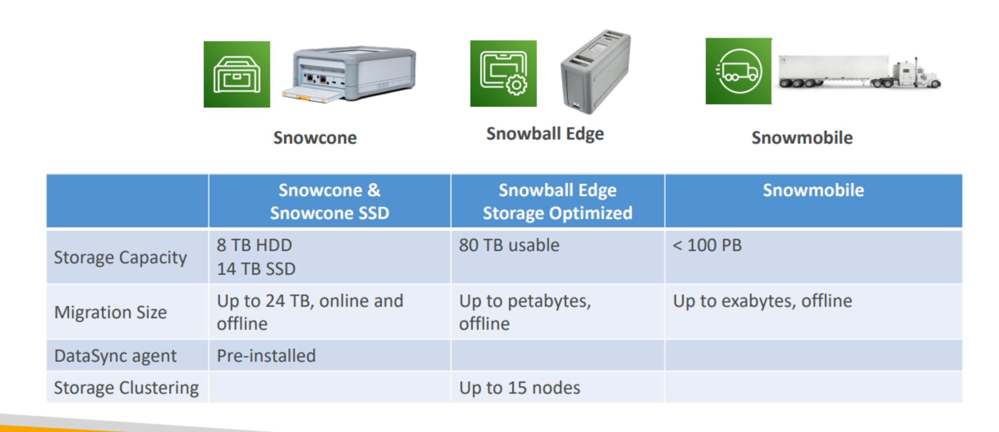
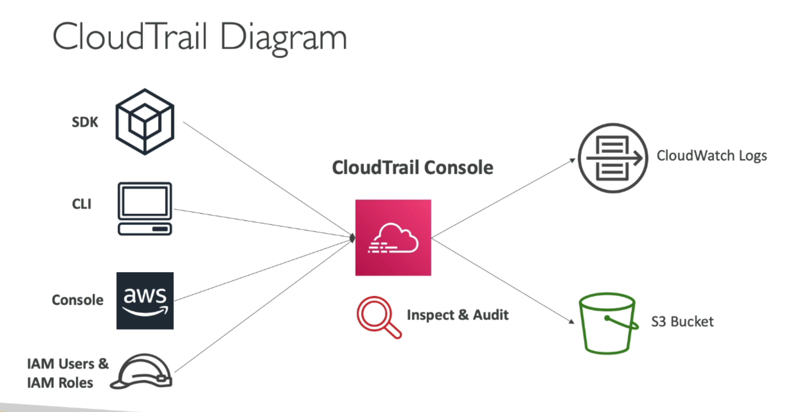
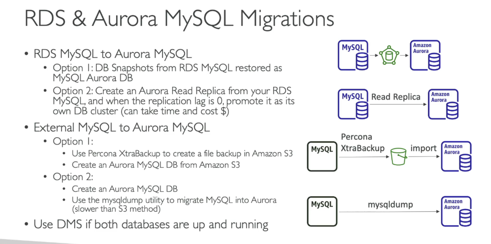

## AWS Organizations

- Global service

- Allows to manage multiple AWS accounts

- **Consolidated Billing**

- do **central manangement**

- share reserved instances and savings plans discounts across accounts

- Service Control Policies (SCP)

  

## IAM

- Common IAM roles

  - EC2 Instance Roles 

  - Lambda Function Roles 

  - Roles for CloudFormation 

- Audit

  IAM Credential Reports & IAM Access Advisor

- Providing access to AWS accounts owned by third parties

  **When third parties require access to your organization's AWS resources, you can use roles to delegate access to them.** For example, a third party might provide a service for managing your AWS resources. With IAM roles, you can grant these third parties access to your AWS resources without sharing your AWS security credentials. Instead, the third party can access your AWS resources by assuming a role that you create in your AWS account.

- Set an **overall policy** for the entrie AWS account 

  A solutions architect wants all new users to have specific complexity requirements and mandatory rotation periods for IAM user passwords.

- IAM Conditions

  <ins>aws:SourceIP</ins> : restrict the client from wich the API calls are being made

  <ins>aws:RequestedRegion</ins>

  <ins>ec2:ResouceTag</ins>

  <ins>aws:MultiFactorAuthPresent</ins>

  <ins>aws:PrincipalOrgID</ins>

  

## AWS IAM Identity Center

One login(single sign-on) for all your AWS accounts in AWS Organizations

## Amazon EventBridge

When the state of an Amazon Machine Image (AMI) changes, Amazon EC2 generates an event that is sent to Amazon EventBridge (formerly known as Amazon CloudWatch Events). You can use Amazon EventBridge to detect and react to these events. You do this by creating rules in EventBridge that trigger an action in response to an event. **For example, you can create an EventBridge rule that detects when the AMI creation process has completed and then invokes an Amazon SNS topic to send an email notification to you.**

## AWS Directory Services / MicroSoft Active Directory

Objects are orgnaized in trees. A group of trees is a forest.

## Amazon CloudFormation

AWS CloudFormation is an **infrastructure-as-code service that automates the process of provisioning infrastructure resources.** It provides a way for developers and system administrators to define and manage infrastructure resources in a declarative way. CloudFormation templates describe resources and their relationships, which are then provisioned and managed as a single unit.

## AWS Storage Gateway

AWS Storage Gateway connects an on-premises software appliance with cloud-based storage to provide seamless integration with data security features between your on-premises IT environment and the AWS storage infrastructure. You can use the service to store data in the Amazon Web Services Cloud for scalable and cost-effective storage that helps maintain data security.

AWS Storage Gateway offers file-based File Gateways (Amazon S3 File and Amazon FSx File), volume-based (Cached and Stored), and tape-based storage solutions.

cached / store

## Amazon EC2

- stop -> ebs kept

- Hibernate: 

  save the RAM state, < 150GB, < 60days

  To **preserve contents of the instance's memory** whenever the instance is unavailable.

- Placement Groups
  - cluster: one AZ
  - partition: 
  - spread

- **Amazon EC2 Auto Scaling lifecycle hooks**

  Amazon EC2 Auto Scaling offers the ability to add lifecycle hooks to your Auto Scaling groups. These hooks let you create solutions that a**re aware of events in the Auto Scaling instance lifecycle, and then perform a custom action on instances when the corresponding lifecycle event occurs**. A lifecycle hook provides a specified amount of time (one hour by default) to wait for the action to complete before the instance transitions to the next state.

  **run scripts**

- Predictive scaling for Amazon EC2 Auto Scaling

  Use predictive scaling to increase the number of EC2 instances in your Auto Scaling group in advance of daily and weekly patterns in traffic flows.

- Auto scaling groups can not span multi region

- **A target tracking policy** allows the Auto Scaling group to automatically adjust the number of EC2 instances in the group **based on a target value for a metric**.

- TCP, UDP, and ICMP.

- Amazon EC2 Dedicated Hosts 

  **Amazon EC2 Dedicated Hosts allow you to use your eligible software licenses from vendors** such as Microsoft and Oracle on Amazon EC2, so that you get the flexibility and cost effectiveness of using your own licenses, but with the resiliency, simplicity and elasticity of AWS. An Amazon EC2 Dedicated Host is a physical server fully dedicated for your use, so you can help address corporate compliance requirements.

  Amazon EC2 Dedicated Host is also integrated with AWS License Manager, a service which helps you manage your software licenses, including Microsoft Windows Server and Microsoft SQL Server licenses. In License Manager, you can specify your licensing terms for governing license usage, as well as your Dedicated Host management preferences for host allocation and host capacity utilization. Once setup, AWS takes care of these administrative tasks on your behalf, so that you can seamlessly launch virtual machines (instances) on Dedicated Hosts just like you would launch an EC2 instance with AWS provided licenses.

- reserved 

  1 & 3 years

  - reserved instances
  - convertible reserved instances

  You can buy and sell in the Reserved Instance Marketplace

- Capacity Reservations: you book a room for a period with full price even you don’t stay in it

- spot fleet = spot Instances + on-demand 

- Elastic IPs

  When you stop and then start an EC2 instance, it can change its public IP.

- Elastic Network Interface(ENI)

  attaced to a EC2 instance, make it be able to be Internetable. 

  Can be transfered to another EC2 , good for failover.

## Amazon Elastic Block Store (Amazon EBS)

- Snapshot

  Can copy snapshots **across AZ or Region**

  **A snapshot is constrained to the AWS Region where it was created.** After you create a snapshot of an EBS volume, you can use it to create new volumes in the same Region. For more information, see [Create a volume from a snapshot](https://docs.aws.amazon.com/AWSEC2/latest/UserGuide/ebs-creating-volume.html#ebs-create-volume-from-snapshot). You can also **copy snapshots across Regions**, making it possible to use multiple Regions for geographical expansion , data center migration, and disaster recovery. You can copy any accessible snapshot that has a `completed` status. For more information, see [Copy an Amazon EBS snapshot](https://docs.aws.amazon.com/AWSEC2/latest/UserGuide/ebs-copy-snapshot.html).

- Fast Snapshot Restore(FSR)

  Amazon EBS fast snapshot restore (FSR) enables you to create a volume from a snapshot that is fully initialized at creation. This **eliminates the latency of I/O operations on a block when it is accessed for the first time**. Volumes that are created using fast snapshot restore instantly deliver all of their provisioned performance.

- [Encryption by default](https://docs.aws.amazon.com/AWSEC2/latest/UserGuide/EBSEncryption.html#encryption-by-default) allows you to ensure that **all new EBS volumes created in your account are always encrypted,** even if you don’t specify encrypted=true request parameter.

- Both GP2 and GP3 has max IOPS 16000 but GP3 is cost effective.

  gp3 Can increase IOPS up to 16,000 and throughput up to 1000 MiB/s independently

  gp2 are linked together to achieve max performance

- **Multi-attach is supported exclusively on  [Provisioned IOPS SSD (io1 and io2) volumes](https://docs.aws.amazon.com/AWSEC2/latest/UserGuide/provisioned-iops.html#EBSVolumeTypes_piops).** up to 16 EC2 instances

  io1/ io2 can handle over 32000 IOPS

## Amazon Machine Image (AMI)

AMI are built for a specific region (and can be copied across regions)

You can launch EC2 instances from: 

- A Public AMI: AWS provided 
- Your own AMI: you make and maintain them yourself • 
- An AWS Marketplace AMI: an AMI someone else made (and potentially sells)

Build an AMI – this **will also create EBS snapshots**

## Amazon Elastic File System (EFS)

- Linux 

- Concurrent or at the same time key word for EFS

- **Portable Operating System Interface (POSIX)** 

- pay per use no capacity planning

- Grow to Petabyte-scale network file system, automatically

- lifecycle policy

## Elastic Load Balancer

EC2, EC2 Auto Scaling Groups, Amazon ECS

AWS Certificate Manager (ACM), CloudWatch

Route 53, AWS WAF, AWS Global Accelerator

- Health Check

## Application Load Balancer

Layer 7 (HTTP, HTTPS, WebSocket)

- **Target Groups**

  EC2, ECS tasks, Lambda (http request -> json event), **private IP** addresses

can do

- http - > https **redirect** rule with ACM

- health check

- Uses Server Name Indication (SNI)

  SNI solves the problem of loading multiple SSL certificates onto one web server (to serve multiple websites) 

  It’s a “newer” protocol, and requires the client to indicate the hostname of the target server in the initial SSL handshake

  The server will then find the correct certificate, or return the default one

## Network Load Balancer

layer 4 ( TCP / UDP / **TLS)**

- **Target Groups**

  EC2, **private IP** addresses, **ALB**

- health check

  Health Checks support the TCP, HTTP and HTTPS Protocols

- Uses Server Name Indication (SNI)

## Gateway Load balancer

Layer 3 (Network layer, IP protocal)

Gateway Load Balancers enable you to deploy, scale, and **manage virtual appliances**, such as firewalls, **intrusion detection** and prevention systems, and **deep packet inspection** systems. It combines a transparent network gateway (that is, a single entry and exit point for all traffic) and distributes traffic while scaling your virtual appliances with the demand.

A Gateway Load Balancer **operates at the third layer of the Open Systems Interconnection (OSI) model,** the network layer. It listens for **all IP packets** across all ports and forwards traffic to the target group that's specified in the listener rule. It maintains stickiness of flows to a specific target appliance using 5-tuple (for TCP/UDP flows) or 3-tuple (for non-TCP/UDP flows). The Gateway Load Balancer and its registered virtual appliance instances exchange application traffic using the [GENEVE](https://datatracker.ietf.org/doc/html/rfc8926) protocol on port 6081

## Cross-Zone Load Balancing

## Auto Scaling Group (ASG)

ASG, Load Balancer multi-AZ

- Min Size / Max Size / Initial Capacity

- It is possible to **scale an ASG based on CloudWatch alarms**

  An alarm monitors a metric (such as Average CPU, or a custom metric)

- Predictive scaling: continuously forecast load and schedule scaling ahead
- scaling based on 
  - CPUUtilization = average CPU
  - RequestCountPerTarget
  - Average Network In / Out
  - Any custom metric (that you push using CloudWatch)
- After a scaling activity happens, you are in the **cooldown period (default 300 seconds)**

## Amazon RDS

- IAM role

- **only gp2 or io1**

- can'r be SSHed

- Continuous backups and restore to specific timestamp (Point in Time Restore)!

- Maintenance windows for upgrades

- Scaling capability (vertical and horizontal)

- By default, all inbound traffic to an RDS instance is blocked. 

- *Multi-AZ deployments are not a read scaling solution, you cannot use a standby replica to serve read traffic. The standby is only there for failover.*

- **Automated Backups**

  This backup occurs during a daily user-configurable 30 minute period known as the **backup window**. Automated backups are kept for a configurable number of days (called the backup retention period). Your automatic backup **retention period can be configured to up to thirty-five days.**

- Creating a read replica

  When you create a read replica, Amazon RDS takes a DB snapshot of your source DB instance and begins replication. As a result, you experience a brief I/O suspension on your source DB instance while the DB snapshot occurs.

  An active, long-running transaction can slow the process of creating the read replica. We recommend that you wait for long-running transactions to complete before creating a read replica. If you create multiple read replicas in parallel from the same source DB instance, Amazon RDS takes only one snapshot at the start of the first create action.

  When creating a read replica, there are a few things to consider. First, you must enable automatic backups on the source DB instance by setting the backup retention period to a value other than 0. This requirement also applies to a read replica that is the source DB instance for another read replica. To enable automatic backups on an RDS for MySQL read replica, first create the read replica, then modify the read replica to enable automatic backups.

- Storage Auto Scaling

  You have to set Maximum Storage Threshold (maximum limit for DB storage)

  RDS Storage Auto Scaling automatically scales storage capacity in response to growing database workloads, with **zero downtime**.

- Amazon RDS event notification 

  doesn't support any notification when data inside DB is updated/deleted/inserted. You can use a SQS to do notification.

- **RDS Multi-AZ = Synchronous = Disaster Recovery (DR)**

  By using Multi-AZ deployment, the company can achieve an **RPO of less than 1 second** because the standby instance is always in sync with the primary instance, ensuring that data changes are continuously replicated.

- **Read Replica = Asynchronous**

  up to 15 read replicas

  Within AZ, Cross AZ or Cross Region

- Amazon RDS Proxy

  - Improving database efficiency by reducing the stress on database resources (e.g., CPU, RAM) and **minimize open connections (and timeouts)**
  - **Reduced RDS & Aurora failover time by up 66%**
  - **RDS Proxy is never publicly accessible (must be accessed from VPC)**
  - • Enforce IAM Authentication for DB, and securely store credentials in AWS Secrets Manager
  - 

- Amazon RDS Custom for Oracle, Microsoft SQL Server Database

  Amazon RDS Custom is a managed database service for legacy, custom, and packaged applications that require access to the underlying operating system and database environment. Amazon RDS Custom automates setup, operation, and scaling of databases in the cloud while **granting customers access to the database and underlying operating system to configure settings, install patches, and enable native features to meet the dependent application's requirements**

  - **You can't create cross-Region RDS Custom for Oracle replicas.**

## Amazon Aurora

- IAM role

- Failover in Aurora is instantaneous. It’s **HA (High Availability) native.** 
- 6 copies of your data across 3 AZ: • 4 copies out of 6 needed for writes • 3 copies out of 6 need for reads • Self healing with peer-to-peer replication • Storage is striped across 100s of volumes • 

- One Aurora Instance takes writes (master) 

- Automated failover for master in less than 30 seconds 

- Master + up to 15 Aurora Read Replicas serve reads 

- Support for Cross Region Replication

  

Aurora is a fully managed, MySQL-compatible relational database that is designed for high performance and high availability. Aurora Multi-AZ deployments **automatically maintain a synchronous standby replica in a different Availability Zone to provide high availability**. Additionally, Aurora Auto Scaling allows you to automatically scale the number of Aurora Replicas in response to read workloads, allowing you to meet the demand of unpredictable read workloads while maintaining high availability. This would provide an automated solution for scaling the database to meet the demand of the application while maintaining high availability.

The most cost-effective solution for **addressing high ReadIOPS and CPU utilization when running large reports would be to migrate the monthly reporting to an Aurora Replica**. An Aurora Replica is a read-only copy of an Aurora database that is updated in real-time with the primary database. By using an Aurora Replica for running large reports, the primary database will be relieved of the additional read load, improving performance for the ecommerce application

- **Amazon Aurora Serverless**

  Amazon Aurora Serverless for MySQL is a fully managed, auto-scaling relational database service that scales up or down automatically based on the application demand. This service provides all the capabilities of Amazon Aurora, such as high availability, durability, and security, **without requiring the customer to provision any database instances.** 

- **Amazon Aurora global databases**

  **span multiple AWS Regions**, enabling low latency global reads and providing **fast recovery from the rare outage** that might affect an entire AWS Region. **An Aurora global database has a primary DB cluster in one Region, and up to five secondary DB clusters in different Regions.**

  **Typical cross-region replication takes less than 1 second**

- **Migrating data from an external MySQL database to an Amazon Aurora MySQL DB cluster  by using an Amazon S3 bucket**

- Migrate an Oracle database to Aurora PostgreSQL using AWS DMS (AWS Data Migration Service ) and AWS SCT(AWS Schema Conversion Tool)

- Aurora Database Cloning

  - Useful to create a “staging” database from a “production” database without impacting the production database
  - Create a new Aurora DB Cluster from an existing one
  - Faster than snapshot & restore
  - Very fast & cost-effective

  

## ElastiCache – Redis vs Memcached

- 3 patterns
  - Lazy Loading
  - Write Through
  - Session Store : set TTL

- SSL Encryption Redis AUTH

## Route 53

Alias Record + Load Balancer

## Elastic Beanstalk

Elastic Beanstalk is a fully managed service that makes it easy to deploy and run applications in the AWS; To enable frequent testing of new site features, you can use URL swapping to switch between multiple Elastic Beanstalk environments.

rolling development (dev, test, prod)

## Amazon S3

S3 is the cheapest and most scalable.

defined at the region level

If uploading more than 5GB, must use “multi-part upload”

public access / Cross-Account Access = bucket policy

user access = IAM Permissons, IAM Policy

- Must enable Versioning in source and destination buckets before Replication
- After you enable Replication, only new objects are replicated

- **S3 Lifecycle policies** 

  allow you to define rules that automatically **transition** or **expire objects based on their age** or other criteria. By configuring an S3 Lifecycle policy to delete expired object versions and retain only the two most recent versions, you can effectively manage the storage costs while maintaining the desired retention policy. This solution is highly automated and requires minimal operational overhead as the lifecycle management is handled by S3 itself.

  - Can be used to delete old versions of files (if versioning is enabled) 

  - Can be used to delete incomplete Multi-Part uploads

- **Requester Pays**

  With Requester Pays buckets, **the requester instead of the bucket owner pays the cost of the request and the data download from the bucket**

  - Helpful when you want to share large datasets with other accounts 
  - The requester must be authenticated in AWS (cannot be anonymous)

- **S3 event notifications** 

  typically deliver events in seconds but can sometimes take a minute or longer

  - EnventBridge

- Configuring fast, secure file transfers using **Amazon S3 Transfer Acceleration**
  - Compatible with multi-part upload

- **S3 Batch Operation**
  - Encrypt un-encrypted objects
  - Copy objects between S3 buckets
  - You can use S3 Inventory to get object list and use S3 Select to filter your objects
  - 

- **CORS** 

  If a client makes a cross-origin request on our S3 bucket, we need to **enable the correct CORS headers**

- **MFA Delete** 

  - Versioning must be enabled on the bucket

  - Only the bucket owner (root account) can enable/disable MFA Delete

- With **S3 Block Public Access,** account administrators and bucket owners can easily set up centralized controls to limit public access to their Amazon S3 resources that are enforced regardless of how the resources are created.

- S3 Standard-Infrequent Access(Standard-IA)

  S3 Standard-IA is designed for infrequently accessed data, and it provides a lower storage cost than S3 Standard, while still offering the same low latency, high throughput, and high durability as S3 Standard.

- S3 One Zone-Infrequent Access (S3 One Zone-IA)

  cheaper, only in one zone, isn't high availabililty

- Discovering and Deleting Incomplete Multipart Uploads to Lower Amazon S3 Costs

- To encrypt an object at the time of upload, you need to add **a header called x-amz-server-side-encryption** to the request to tell S3 to encrypt the object using SSE-C, SSE-S3, or SSE-KMS.

  SSE-S3

  - **SSE-S3 key is handled, managed, and owned by AWS**
  - "x-amz-server-side-encryption" : "AES256"
  - enbled by defualy for new buckets & new objects

  SSE-KMS

  - **SSE-KMS keys are hanled and managed by AWS KMS**
  - user control + audit key usage using CloudTrail
  - "x-amz-server-side-encryption" : "aws:kms"
  - Cons: expensive, every time you upload / download an object, you need to pay the api call to KMS

  SSE-C

  - **fully managed by the customer outside of AWS**
  - S3 does not store the key
  - HTTPS must be used
  - key must provided ain HTTP headers, for every HTTP request
  - HTTPS is mandatory for SSE)C

- asw:SecureTransport

  force encryption in transit

- **S3 Storage Lens** is a fully managed S3 storage analytics solution that provides a comprehensive view of object storage usage, activity trends, and recommendations to optimize costs. Storage Lens allows you to **analyze object access patterns** across all of your S3 buckets and generate detailed metrics and reports.

- S3 Object Lambda

- Expiration / NoncurrentVersionExpiration 

- S3 Replication (cross region)

  - Unencrypted objects and objects encrypted with SSE-S3 are replicated by default

  - Objects encrypted with SSE-C(customer provided key) are never replicated
  - For objects encrypted with SSE-KMS, you need to enable the option(IAM Roles .....)

- **S3 can NOT send event notification to SageMaker.**

- S3 File Gateway

  cache recent access file

- S3 Lifecycle Policy

- s3:PutObjectLegalHold

  The Object Lock legal hold operation enables you to place a legal hold on an object version. Like setting a retention period, **a legal hold prevents an object version from being overwritten or deleted.** However, a legal hold doesn't have an associated retention period and remains in effect until removed.

- preassigned URL

  preassigned URL is for upload or download for temporary time and for specific users outside the company. signed URL is for temporary access

  - Allow only logged-in users to download a premium video from your S3 bucket

- **S3 Object Lock (versioning must be enabled)**

  - Compliance Mode

    In compliance mode, a protected object version can't be overwritten or deleted by any user, including the root user in your AWS account. When an object is locked in compliance mode, its retention mode can't be changed, and its retention period can't be shortened.

    **Compliance mode helps ensure that an object version can't be overwritten or deleted for the duration of the retention period.**

  - Governance Mode

    In governance mode, users can't overwrite or delete an object version or alter its lock settings unless they have special permissions. With governance mode, you protect objects against being deleted by most users, but you can still grant some users permission to alter the retention settings or delete the object if necessary. 

    **In Governance mode, Objects can be deleted by some users with special permissions.**

- S3 Object Lambda

  Use Cases: 

  - Redacting personally identifiable information for analytics or non- production environments.
  - Converting across data formats, such as converting XML to JSON. 
  -  Resizing and watermarking images on the fly using caller-specific details, such as the user who requested the object.

- Create Dynamic Contact Forms for S3 Static Websites Using AWS Lambda, Amazon API Gateway, and Amazon SES 

## Amazon CloudFront

**ALB, EC2, S3 (static S3 website), Any HTTP backend**

ALB and EC2 must be public.

- CloudFront caches the static content. **It also accepts requests for dynamic content and forward it to the ALB via AWS backbone (very fast).**

- CloudFront offers several options for streaming your media to global viewers—**both pre-recorded files and live events.**

- Using AWS Lambda with **CloudFront Lambda@Edge**

  Lambda@Edge lets you run **Node.js and Python** Lambda functions to **customize content that CloudFront delivers**, 

  - Inspect cookies to rewrite URLs to different versions of a site for A/B testing.
  - **Send different objects to your users based on the `User-Agent` header,** which contains information about the device that submitted the request. **For example, you can send images in different resolutions to users based on their devices.**
  - **Inspect headers or authorized tokens**, inserting a corresponding header and allowing access control before forwarding a request to the origin.
  - Add, delete, and modify headers, and rewrite the URL path to direct users to different objects in the cache.
  - Generate new HTTP responses to do things like redirect unauthenticated users to login pages, or create and deliver static webpages right from the edge.
  - Resizing Images

- **Field-level Encrpytion**

  Field-level encryption allows you to enable your users to securely upload sensitive information to your web servers. **The sensitive information provided by your users is encrypted at the edge, close to the user, and remains encrypted throughout your entire application stack**

- origin access identity (OAI) / origin Access Control (OAC)

  I want to restrict access to my Amazon Simple Storage Service (Amazon S3) bucket so that objects can be a**ccessed only through my Amazon CloudFront distribution**. How can I do that? Create a CloudFront origin access identity (OAI)

- If you want CloudFront to cache different versions of your objects based on the **language specified** in the request, configure CloudFront to forward the `Accept-Language` header to your origin.

- **CloudFront geographic restrictions**

  When a user requests your content, CloudFront typically serves the requested content regardless of where the user is located. If you need to prevent users in specific countries from accessing your content, you can use the CloudFront geographic restrictions feature to do one of the following:

  - Allow your users to access your content only if they’re in one of the approved countries on your allow list.
  - Prevent your users from accessing your content if they’re in one of the banned countries on your block list

- **Serving private content with signed URLs and signed cookies**

  Many companies that distribute content over the internet want to restrict access to documents, business data, media streams, or content that is intended for selected users, for example, users who have paid a fee. To securely serve this private content by using CloudFront, you can do the following:

  - Require that your users access your private content by using special CloudFront signed URLs or signed cookies.
  - Require that your users access your content by using CloudFront URLs, not URLs that access content directly on the origin server (for example, Amazon S3 or a private HTTP server). Requiring CloudFront URLs isn't necessary, but we recommend it to prevent users from bypassing the restrictions that you specify in signed URLs or signed cookies.

## AWS Global Accelerator

**TCP / UDP, gaming, IoT, Voice over IP(VoIP)**

health check

AWS shield

no cache

## AWS Snowball Family

- Snowball Edge Storage Optimized devices

  - **Snowball Edge storage-optimized (for data transfer)** – This Snowball Edge device option has a 100 TB (80 TB usable) storage capacity.

  - **Snowball Edge storage-optimized 210 TB** – This Snowball Edge device option has 210 TB of usable storage space.

  - **Snowball Edge storage-optimized (with EC2 compute functionality)** – This Snowball Edge device option has up to 80 TB of usable storage space, 40 vCPUs, and 80 GB of memory for compute functionality. It also comes with 1 TB of additional SSD storage space for block volumes attached to Amazon EC2 AMIs.

  - **Snowball Edge compute-optimized** – This Snowball Edge device (with AMD EPYC Gen2) has the most compute functionality, with up to 104 vCPUs, 416 GB of memory, and 28 TB of dedicated NVMe SSD for compute instances.

    Snowball Edge compute-optimized (with AMD EPYC Gen1) has up to 52 vCPUs, 208 GB of memory, 42 TB (39.5 TB usable) storage space, and 7.68 TB of dedicated NVMe SSD for compute instances.

  - **Snowball Edge compute-optimized with GPU** – This Snowball Edge device option is identical to the compute-optimized (with AMD EPYC Gen1) option and includes an installed graphics processing unit (GPU). The GPU is equivalent to the one available in the P3 Amazon EC2 instance type.

​	On a Snowball Edge device you can copy files with a speed of up to 100Gbps. 70TB will take around 5600 seconds, so very quickly, less than 2 hours. The downside is that it'll take between 4-6 working days to receive the device and then another 2-3 working days to send it back and for AWS to move the data onto S3 once it reaches them. Total time: 6-9 working days. Bandwidth used: 0.

- • Snowball cannot import to Glacier directly • You must use Amazon S3 first, in combination with an S3 lifecycle policy

## Amazon FSx

- HPC + Linux -> FSx for Lustre

  FSx for Lustre makes it easy and cost-effective to launch and run the popular, high-performance Lustre file system. You use Lustre for workloads where speed matters, such as machine learning, high performance computing (HPC), video processing, and financial modeling. Amazon Fsx for Lustre is integrated with Amazon S3.

- windows -> FSx for Windows

- smb -> FSx

- **For shared storage between Linux and windows you need to implement Amazon FSx for NetApp ONTAP**(for both NFS and SMB)

## AWS Transfer Family

For Exam : Whenever you see **SFTP , FTP** look for "Transfer" in options available.

**tansfer into and out of Amazon S3 or EFS using FTP**

IAM Role

AWS Transfer Family is a fully managed AWS service that you can use to **transfer files into and out of** **Amazon Simple Storage Service (Amazon S3) storage or Amazon Elastic File System (Amazon EFS)** file systems over the following protocols: Secure Shell (SSH) File Transfer Protocol (SFTP): version 3 File Transfer Protocol Secure (FTPS) File Transfer Protocol (FTP) Applicability **Statement 2 (AS2)**

- Working with custom **identity providers**

  You integrate your identity provider using an AWS Lambda function, which authenticates and authorizes your users for access to Amazon S3 or Amazon Elastic File System (Amazon EFS).

## Amazon DataSync

**NFS, SMB, HDFS, S3, EFS, FSx, Snowcone**

Better for one-time migration ?

securely

To automate the process of transferring the data from the on-premises SFTP server to an EC2 instance with an EFS file system, you can use AWS DataSync. AWS DataSync is a fully managed data transfer service that simplifies, automates, and accelerates transferring data between on-premises storage systems and **Amazon S3, Amazon EFS, or Amazon FSx for Windows File Server.** To use AWS DataSync for this task, you should **first install an AWS DataSync agent in the on-premises data center**. This agent is a lightweight software application that you install on your on-premises data source. T**he agent communicates with the AWS DataSync service to transfer data between the data source and target locations.**

## Amazon SQS

- Access Controls: **IAM policies** to regulate access to the SQS API

- For **Maximum message size**, enter a value. The range is **1 KB to 256 KB**. The default value is 256 KB.

- **Message Visibility Timeout** 

  to avoid duplicates

- **Long polling** 

  can be enabled at the queue level or at the API level using **WaitTimeSeconds**

  LongPolling **decreases the number of API calls made to SQS** while increasing the efficiency and reducing latency of your application

- To manage large Amazon Simple Queue Service (Amazon SQS) messages, you can use Amazon Simple Storage Service (Amazon S3) and the **Amazon SQS Extended Client Library for Java.** This is especially useful for storing and consuming messages **up to 2 GB.** Unless your application requires repeatedly creating queues and leaving them inactive or storing large amounts of data in your queues, consider using Amazon S3 for storing your data.

- Standard queue

- FIFO queue

- dead-letter queues(DLQ)

  Amazon SQS supports dead-letter queues (DLQ), which other queues (source queues) can target for messages that can't be processed (consumed) successfully.

## Amazon SNS(Simple Notification Service)

- pub/sub messaging service, one-to-many communication
- Access Controls: **IAM policies** to regulate access to the SNS API

Amazon SNS defines a *delivery policy* for each delivery protocol. The delivery policy defines how Amazon SNS retries the delivery of messages when server-side errors occur (when the system that hosts the subscribed endpoint becomes unavailable). When the delivery policy is exhausted, Amazon SNS stops retrying the delivery and discards the message—unless a dead-letter queue is attached to the subscription. For more information,

**A dead-letter queue associated with an Amazon SNS subscription is an ordinary Amazon SQS queue.**

- Fan Out

- Message Filtering

- can target to Kinese Data Firehose

  

## Amazon Kinesis Data Streams

**Retention between 1 day to 365 days**

Kinesis streams **don't have fail-safe** for failed processing, unlike SQS.Amazon ECS

## Amazon Kinesis Data Firehose

a fully managed service for **streaming data to Amazon OpenSearch Service** (Amazon Elasticsearch Service) and other destinations. You can configure the log group as the source of the delivery stream and Amazon OpenSearch Service as the destination. This solution requires minimal operational overhead, as Kinesis Data Firehose automatically scales and handles data delivery, transformation, and indexing.

Amazon Kinesis Data Firehose, which is a fully managed service that can automatically handle the data collection, data transformation, encryption, and data storage in **near-real time**. Kinesis Data Firehose can automatically store the data in Amazon S3 in Apache Parquet format for further processing. 

- Supports many data formats, conversions, transformations, compression 
-  Supports custom data transformations using AWS Lambda 
-  Can send failed or all data to a backup S3 bucket

## Amazon Kinesis Analytics

Amazon Kinesis Data Analytics is the easiest way to **transform and analyze streaming data in real time with Apache Flink**. Apache Flink is an open-source framework and engine for processing data streams. Kinesis Data Analytics reduces the complexity of building, managing, and integrating Apache Flink applications with other AWS services.

**near-real-time data querying** = Kinesis analytics

With Amazon Kinesis Data Analytics for SQL Applications, you can process and analyze streaming data using standard SQL. The service enables you to quickly author and run powerful SQL code against streaming sources to perform time series analytics, feed real-time dashboards, and create real-time metrics.

## ECS

IAM Roles

- AWS Fargate (serverless)

  AWS Fargate is a technology that you can use with Amazon ECS to run containers without having to manage servers or clusters of Amazon EC2 instances. With Fargate, you no longer have to provision, configure, or scale clusters of virtual machines to run containers. This removes the need to choose server types, decide when to scale your clusters, or optimize cluster packing. 

  Fargate + EFS

- To ensure that an Amazon Elastic Container Service (ECS) application has permission to access Amazon Simple Storage Service (S3), the correct solution is to create an AWS Identity and Access Management (IAM) role with the necessary S3 permissions and specify that role as the taskRoleArn(Amazon Resource Name) in the task definition for the ECS application. 

- Auto Scaling

  - target tracking: a specific CloudWatch metric
  - step scaling: scale based on a specified CloudWatch Alarm
  - Scheduled Scaling: scale based on a specific date / time

  ECS Service Auto Scaling(task level) != EC2 Auto Scaling(EC2 level)

## Amazon ECR

- Store and manage Docker images on AWS

- Fully integrated with ECS, backed by Amazon S3
- Access is controlled through IAM (permission errors => policy)

## AWS Lambda Function

- CloudWatch Events EventBridge -> trigger every certain time -> AWS lambda function perofrom a task

- Limits

  Maximum timeout 15 min

  memory allocation : **128 MB - 10 GB**

  Environment variables 4 KB

  disk capacity 512MB - 10 GB

  vCPU cores: 6

- Lambda in VPC

  Lambda will create an **ENI(Elastic Network Interface)** in your subnets

  Lambda with RDS Proxy

  **The Lambda function must be deployed in your VPC, because RDS Proxy is never pubilcly accessible.**

- **Provisioned concurrency** 

  Provisioned concurrency is the number of pre-initialized execution environments you want to allocate to your function. T**hese execution environments are prepared to respond immediately to incoming function requests**. Configuring provisioned concurrency incurs charges to your AWS account.

  Configuring provisioned concurrency would get rid of the "cold start" of the function therefore speeding up the proccess.

- Create an IAM execution role with the required permissions and attach the IAM role to the Lambda function.

## Savings Plans

- Compute Savings Plans

  Compute Savings Plans provide the most flexibility and help to reduce your costs by up to 66%. These plans automatically apply to EC2 instance usage **regardless of instance family**, size, AZ, Region, OS or tenancy, and **also apply to Fargate or Lambda usage**. For example, with Compute Savings Plans, you can change from C4 to M5 instances, shift a workload from EU (Ireland) to EU (London), or move a workload from EC2 to Fargate or Lambda at any time and automatically continue to pay the Savings Plans price.

- EC2 Instance Savings Plans

  EC2 Instance Savings Plans provide the lowest prices, offering savings up to 72% in exchange for commitment to usage of individual instance families in a Region (e.g. M5 usage in N. Virginia). This automatically reduces your cost on the selected instance family in that region regardless of AZ, size, OS or tenancy. EC2 Instance Savings Plans give you the flexibility to change your usage between instances **within a family in that region**. For example, you can move from c5.xlarge running Windows to c5.2xlarge running Linux and automatically benefit from the Savings Plan prices.

- Turning on shared reserved instances and Savings Plans discounts

  You can use the console to turn RI sharing discounts back on for an account.

  You can share Savings Plans with a set of accounts. You can either choose to not share the benefit with other accounts, or to open up line item eligibility for the entire consolidated billing family of accounts.

## Amazon DynamoDB

- hierachical data

- DynamoDB supports some of the world's largest scale applications by providing consistent, **single-digit millisecond response times at any scale**. You can build applications with virtually unlimited throughput and storage.

- highly available with replication across multiple AZs

- NoSQL databse with transaction suppport.

- standard / infrequent access tables 

- In DynamoDB, you can rapidly evolve schemas

- **DynamoDB Streams** 

  **captures a time-ordered sequence of item-level modifications** in any DynamoDB table and stores this information in a log for up to 24 hours. Applications can access this log and view the data items as they appeared before and after they were modified, in near-real time.

- Amazon DynamoDB has two **read/write capacity** modes for processing reads and writes on your tables:

  1. Provisioned Mode (default)

     plan capacity beforehand

     provisioned capacity with optional auto-scaling

  2. On-demand Capacity (expensive)

     When you choose on-demand mode, DynamoDB instantly **accommodates your workloads** as they ramp up or down to any previously reached traffic level. If a workload’s traffic level hits a new peak, **DynamoDB adapts rapidly to accommodate the workload**. Tables that use on-demand mode deliver the same single-digit millisecond latency, service-level agreement (SLA) commitment, and security that DynamoDB already offers. You can choose on-demand for both new and existing tables and you can continue using the existing DynamoDB APIs without changing code.

     On-demand mode is a good option if any of the following are true:

     - You create new tables with unknown workloads.

     - You have **unpredictable** application traffic.

     - You prefer the ease of paying for only what you use.

- DAX (DynamoDB Accelarator)

  Amazon DynamoDB Accelerator (DAX) is a fully managed, highly available, **seamless in-memory cache for DynamoDB** that helps improve the read performance of DynamoDB tables. DAX provides a caching layer between the application and DynamoDB, reducing the number of read requests made directly to DynamoDB. This can significantly reduce read latencies and improve overall application performance.

- **DynamoDB Global Tables**

  enable DynamoDB Streams first

  two-way replication, active-active replication

  accessible with low latency in multiple-regions

- TTL

  automatically delete items after an expiry timestamp 

  use cases: web session handling

- **DynamoDB offers two built-in backup methods:**

  - **[Point-in-time recovery](https://docs.aws.amazon.com/amazondynamodb/latest/developerguide/PointInTimeRecovery.html): Turn on automatic and continuous backups.**

    DynamoDB Export to S3 feature

    Using this feature, you can export data from an Amazon DynamoDB table anytime within your point-in-time recovery window to an Amazon S3 bucket. For more information, see [DynamoDB data export to Amazon S3](https://docs.aws.amazon.com/amazondynamodb/latest/developerguide/S3DataExport.HowItWorks.html).

  - [On-demand](https://docs.aws.amazon.com/amazondynamodb/latest/developerguide/BackupRestore.html): Create backups when you choose.

    On demand backups are designed **for long-term archiving and retention**, which is typically used to help customers meet compliance and regulatory requirements.

## Amazon API Gateway

IAM Roles, Cognito to do authentication

AWS Lambda + API Gateway ,support for the WebSocket Protocol, API versioning, different environments, security

- **usage plan and API keys [subscription, control access]**

  A *usage plan* specifies who can access one or more deployed API stages and methods—and optionally sets the target request rate to start throttling requests. The plan uses API keys to identify API clients and who can access the associated API stages for each key.

  *API keys* are alphanumeric string values that you distribute to application developer customers to grant access to your API. You can use API keys together with [Lambda authorizers](https://docs.aws.amazon.com/apigateway/latest/developerguide/apigateway-use-lambda-authorizer.html), [IAM roles](https://docs.aws.amazon.com/apigateway/latest/developerguide/permissions.html), or [Amazon Cognito](https://docs.aws.amazon.com/apigateway/latest/developerguide/apigateway-integrate-with-cognito.html) to control access to your APIs. API Gateway can generate API keys on your behalf, or you can import them from a [CSV file](https://docs.aws.amazon.com/apigateway/latest/developerguide/api-key-file-format.html). You can generate an API key in API Gateway, or import it into API Gateway from an external source. For more information, see [Set up API keys using the API Gateway console](https://docs.aws.amazon.com/apigateway/latest/developerguide/api-gateway-setup-api-key-with-console.html).

- API Gateway + Kinesis Data Stream + Kinesis Data Firehose + S3

## Amazon Cognito

To control access to the REST API and reduce development efforts, the company can use an **Amazon Cognito user pool authorizer in API Gateway**. This will allow Amazon Cognito to validate each request and ensure that only authenticated users can access the API. This solution has the **LEAST operational overhead**, as it does not require the company to develop and maintain any additional infrastructure or code.

Identity Pool -> IAM Role

Short description. **User pools are for authentication (identity verification)**. With a user pool, your app users can sign in through the user pool or federate through a third-party identity provider (IdP). **Identity pools are for authorization (access control)**

Using Cognito to **generate temporary credentials with STS** to access S3 bucket with restricted policy. App users can directly access AWS resources this way. Pattern can be applied to DynamoDB, Lambda…

## Amazon Neptune

graph database, social network, knowledge graph, posts have comments, recommendation engines 

## Amazon Keyspaces

**Apache Cassandra**

## Amazon QLDB (Quantum Ledger Database)

**immutable** system, **Ledger**, no decentralization

## Amazon TimeStream

serverless, time series data, auto scaling

## AWS Batch

AWS Batch is a fully-managed service that can launch and manage the compute resources needed to execute batch jobs. It can scale the compute environment based on the size and timing of the batch jobs.

## Amazon Athena

**S3**, **Logs**

Athena helps you analyze unstructured, semi-structured, and structured data **stored in Amazon S3**. Examples include **CSV, JSON, or columnar data formats such as Apache Parquet and Apache ORC**. You can use Athena to run **ad-hoc queries** using ANSI SQL, without the need to aggregate or load the data into Athena.

- Amazon Athena + Lambda (Data Source Connector) Frderated Query -> S3

- Amazon Athena DynamoDB connector

  The Amazon Athena DynamoDB connector **enables Amazon Athena to communicate with DynamoDB so that you can query your tables with SQL**. Write operations like [INSERT INTO](https://docs.aws.amazon.com/athena/latest/ug/insert-into.html) are not supported.

  - run Federated Queries

## Amazon RedShift

Amazon Redshift is a fully managed, **petabyte-scale data warehouse** service in the cloud. Amazon Redshift Serverless lets you access and analyze data without all of the configurations of a provisioned data warehouse.

**OLAP - online analytical processing (analytics and data warehousing)**

**PBs of data**

faster queries / joins / aggregations thanks to indexes

**Redshift cluster**: Leader node + computer node (provison the node size in advance)

- Use case :
  - Amazon Kinesis Data Firehose + Amazon Redshift Cluster (through S3 copy)
  - S3 + Amazon Redshift Cluster(s3 copy, through VPC or Internet)
  - EC2 + Amazon Redshift Cluster(though JDBC driver, better to write data in batches)

**Redshit Spectrum**: do analyze without having previous data in your cluster, can do analyzze directly on-premis  S3 bucket but you need a cluster at first to start your query

## Amazon OpenSearch (ElasticSearch)

Ingestion form Kinesis Data Firehose, IoT, CloudWatch Logs ...

doesn't support sql query

OpenSearch Dashboards

## Amazon EMR (Elastic MapReduce)

helps creating Hadoop clusters(Big Data) , can be made of hundreds of EC2 instances

Master Node(long running) + Core Node(long running) + Task Node(usually spot)

## Amazon QuickSight

RDS, Aurora, Redshit, Athena, S3, OpenSearchm Timestream. Salesforce, Jira, on-premises Databasesm Data Source(xlsx, csv ...)

**Users and Groups**

QuickSight **don't support IAM. We use users and groups** to view the QuickSight dashboard

## Amazon Glue

- AWS Glue allows fully managed **CSV to Parquet** conversion jobs

  s3 + Glue ETL + S3 + Athena

- **Job bookmarks help AWS Glue maintain state information and prevent the reprocessing of old data.**

- Use case:

  s3 / RDS + Glue ETL + Redshift Data Warehouse

## AWS Lake Formation

AWS Lake Formation is a fully managed service that helps you build, secure, and manage data lakes, and provide access control for data in the data lake. Customers across lines of business (LOBs) need a way to **manage granular access permissions for different users at the table and column level**. Lake Formation helps you manage fine-grained access for internal and external customers from a centralized location and in a scalable way.

build **find-grained Access Control** for your application 

There are two options to share your databases and tables with another account by using **Lake Formation cross-account access control:**

- Lake Formation tag-based access control (recommended)
- Lake Formation named resources

Enforcing column-level security in Lake Formation

## Amazon Rekognition

Amazon Rekognition makes it easy to add **image** and video analysis to your applications. You just provide an image or video to the Amazon Rekognition API, and the service can identify objects, people, text, scenes, and activities. It can detect any inappropriate content as well. Amazon Rekognition also provides highly accurate facial analysis and facial recognition. With Amazon Rekognition Custom Labels, you can create a machine learning model that finds the objects, scenes, and concepts that are specific to your business needs.

## Amazon Transcribe

speech -> text

Amazon Transcribe is a service that **automatically transcribes spoken language into written text**. It can handle **multiple speakers** and can generate transcript files in real-time or asynchronously. These transcript files can be stored in Amazon S3 for long-term storage. 

## Amazon Polly

Turn text into lifelike speech using deep learning

## Amazon Translate

Natural and accurate language translation 

Amazon Translate allows you to **localize content - such as websites and applications** - for international users, and to easily translate large volumes of text efficiently

## Amazon Comprehend & Medical

Amazon Comprehend uses **natural language processing (NLP)** to extract insights about the content of documents. It develops insights by recognizing the entities, key phrases, language, sentiments, and other common elements in a document. Use Amazon Comprehend to create new products based on understanding the structure of documents. For example, using Amazon Comprehend you can search social networking feeds for mentions of products or scan an entire document repository for key phrases.

- Uses NLP to detect **Protected Health Information (PHI)** – DetectPHI API

## AWS SageMaker

Amazon SageMaker is a fully managed **machine learning service**. With SageMaker, data scientists and developers can quickly and easily build and train machine learning models, and then directly deploy them into a production-ready hosted environment. It provides an integrated Jupyter authoring notebook instance for easy access to your data sources for exploration and analysis, so you don't have to manage servers. It also provides common machine learning algorithms that are optimized to run efficiently against extremely large data in a distributed environment. With native support for bring-your-own-algorithms and frameworks, SageMaker offers flexible distributed training options that adjust to your specific workflows. Deploy a model into a secure and scalable environment by launching it with a few clicks from SageMaker Studio or the SageMaker console.

## Amazon Textract

Amazon Textract enables you to add document text detection and analysis to your applications. You provide a document image to the Amazon Textract API, and the service detects the document text. Amazon Textract works with formatted text and can detect words and lines of words that are located close to each other. It can also analyze a document for items such as related text, tables, key-value pairs, and selection elements.

## Amazon Lex

build conversational bots – chatbots

## Amazon Forecast

build highly accurate forecasts

## Amazon Kendra

ML-powered search engine

## Amazon Elastic Transcoder

Amazon Elastic Transcoder is media transcoding in [the cloud](https://aws.amazon.com/what-is-cloud-computing/). It is designed to be a highly scalable, easy to use and a cost effective way for developers and businesses to convert (or “transcode”) media files from their source format into versions that will playback on devices like smartphones, tablets and PCs.

## Amazon CloudWatch

procides metrics for every services in AWS

- make a dashboard 

- **EC2 do not provide by default memory metrics to CloudWatch and require the CloudWatch Agent to be installed on the monitored instances** (IAM roles)

  - CloudWatch Unified Agent

- You can use metric streams to continually stream CloudWatch metrics to a destination of your choice, with **near-real-time** delivery and low latency. One of the use cases is Data Lake: create a metric stream and direct it to an Amazon Kinesis Data Firehose delivery stream that delivers your CloudWatch metrics to a data lake such as Amazon S3. 

- composite alarm

  The composite alarm goes into ALARM state **only if all conditions of the rule are met.**

- **Streaming CloudWatch Logs data to Amazon OpenSearch Service**

  You can configure a CloudWatch Logs log group to stream data it receives to your Amazon OpenSearch Service cluster **in near real-time through a** **CloudWatch Logs subscription.** For more information

- **Logs Insight**

  query logs

- **Log Subscriptions**

  for **near/real time** store 

  

## Amazon CloudTrail

 CloudTrail provides event history of your AWS account activity, including actions taken through the AWS Management Console, AWS Command Line Interface (CLI), and AWS SDKs and APIs. By enabling CloudTrail, the company **can track user activity and changes to AWS resources, and monitor compliance with internal policies and external regulations.	**

## AWS Config

Configuration changes= AWS Config

per-region

AWS Config provides a detailed view of the resources associated with your AWS account, including how they are configured, how they are related to one another, and how the configurations and their relationships have **changed over time**.

- Config Rules

  Rules can be evaluated / triggered

## VPC (Virtual Private Cloud)

A new AWS account has a default VPC. When you create an EC2 instance, it is automatically being added into this VPC. This defualt VPC has Internet Access, And the EC2 instance has a public IPv4 address.

A vpc spans all of the availability Zones in a Region,After you create a VPC, you can add one or more subnets in each Availability Zone.**a subnet is per AZ**, **AWS reserves 5 IP Addresses(first 4 & last 1) in each subnet**

- Private VPC Link

  **A VPC link is a resource in Amazon API Gateway that allows for connecting API routes to private resources inside a VPC.**

- CIDR blocks 

  A CIDR consists of tow components

  - Base IP

  - Subnet Mask

    /0, /24, /32, **in AWS VPC, min is 16 max is 24**

    

    

- VPC Flow Logs

  VPC Flow Logs is a feature that enables you to capture information about the IP traffic going to and from network interfaces in your VPC. Flow log data can be published to the following locations: Amazon CloudWatch Logs, Amazon S3, or Amazon Kinesis Data Firehose. After you create a flow log, you can retrieve and view the flow log records in the log group, bucket, or delivery stream that you configured. Flow logs can help you with a number of tasks, such as: 

  - DRP or SSH

  - Diagnosing overly restrictive security group rules 

  - Monitoring the traffic that is reaching your instance 

  - Determining the direction of the traffic to and from the network interfaces

- VPC peering

  A VPC peering connection is a networking connection between two VPCs that enables you to route traffic between them **privately**. Resources in peered VPCs can communicate with each other as if they are within the same network. You can create a VPC peering connection **between your own VPCs, with a VPC in another AWS account, or with a VPC in a different AWS Region**.  You can reference a security group in a peered VPC. Traffic between peered VPCs never traverses the public internet. 

  VPC Peering is not transitive.

  

- Traffic Mirroring

  Traffic Mirroring is an Amazon VPC feature that you can use to copy network traffic from an elastic network interface of type `interface`. You can then send the traffic to out-of-band security and monitoring appliances for:

  - Content inspection
  - Threat monitoring 
  - Troubleshooting

  The security and monitoring appliances can be deployed as individual instances, or as a fleet of instances behind either a Network Load Balancer or a Gateway Load Balancer with a UDP listener. Traffic Mirroring supports filters and packet truncation, so that you can extract only the traffic of interest, using the monitoring tools of your choice.

- VPC endpoint

  VPC endpoint allows you to connect to AWS services using a private network instead of using the public Internet

  A VPC endpoint enables **private connectivity between the VPC and S3 / DynamoDB without using an internet gateway or NAT device.** 

  VPC Endpoints **(powered by AWS PrivateLink)** allows you to connect to AWS services using a private network instead of using the public Internet.

  

  

- Interface Endpoint

  an interface endpoint is a horizontally scaled, redundant VPC endpoint that provides private connectivity to a service. It is an elastic network interface with a private IP address that serves as an entry point for traffic destined to the AWS service. Interface endpoints are used to connect VPCs with AWS services

  

## AWS Direct Connect

private connection

Lead times are often l**onger than 1 month to establish** a new connection

- **Dedicated connections**, where a physical ethernet connection is associated with a single customer. You can order port s**peeds of 1, 10, or 100 Gbps**. You might need to work with a partner in the **AWS Direct Connect Partner** Program to help you establish network circuits between an AWS Direct Connect connection and your data center, office, or colocation environment.
- **Hosted connections**, where a physical ethernet connection is provisioned by an **AWS Direct Connect Partner** and shared with you. You can order port speeds between **50 Mbps, 500Mbps and 10 Gbps**. Your work with the Partner in both the AWS Direct Connect connection they established and the network circuits between an AWS Direct Connect connection and your data center, office, or colocation environment.

- VPC Flow Log

  can be sent to S3, CloudWatch, Kinesis Data Firehose

- Site-to-Site VPN

  use site-to-site VPN as a backup for DX

  

  

## Internet Gateway(IGW) & Route tables 

Allows resources in a VPC connect to the Internet

Scales horizontally and is highly available and redundant

must be **created seperately from a VPC**

**one VPC can only be attaced to one IGW and vice verss**

Internet Gateway on their own do not allow Internet access. **Route tables** must also be edited

## Bastion Host 

A bastion host is **a server used to manage access to an internal or private network from an external network** - sometimes called a jump box or jump server. Because bastion hosts often sit on the Internet, they typically run a minimum amount of services in order to reduce their attack surface.

All above only guarantees that the private EC2s can be connected by SSH through Bastion Hosts, they still has no access to the outer Internet.

## NAT Gateway

NAT = Network Address Translation

NAT Gateway will be created in a Public Subnet and Provide access to Private Subnet

Each NAT gateway is created **in a specific Availability Zone** **using an Elastic IP** and implemented with redundancy in that zone.

also require an IGW (private subnet => NATGW => IGW)

## Egress-only Internet Gateway

like a NAT Gateway, but for APv6

## Security Groups & NACLs

NACL is outer layer and stateless.

SG is inner layer and stateful.

## Network Access Control List(NACL)

NACL  is like a firewall which control traffic from and to subnets. **One NACL per subnet**.

**First rule match will drive the decision.**

**Newly created NACLs will deny everything. Default NACL accpets everything inbound/outbound with the subnets it's associated with**

Do not modify the default one, instead create custom NACLs

NACLs are a great way o blocking a specific IP address at the subnet level.  

**NACL with Ephemreal Ports**

## Transit Gateway

transitive peering connections for VPC, VPN & DX

A *transit gateway* is a network transit hub that you can use to interconnect your **virtual private clouds (VPCs) and on-premises networks**. As your cloud infrastructure expands globally, inter-Region peering connects transit gateways together using the AWS Global Infrastructure. Your data is automatically encrypted and never travels over the public internet.

**Transit Gateway Peering**: Transit Gateway supports **peering connections across AWS Regions**, allowing you to establish connectivity between VPCs in different Regions without the need for complex VPC peering configurations. This simplifies the management of VPC communications across Regions.

## 

## Amazon Simple Email Service(SES)

Amazon SES is a cost-effective and scalable email service that enables businesses to send and receive email using their own email addresses and domains. Configuring the web instance to send email through Amazon SES is a simple and effective solution that can **reduce the time spent resolving complex email delivery issues and minimize operational overhead**

## Amazon DocumentDB

MongoDB

## AWS Network Firewall

AWS Network Firewall is a managed firewall service that provides filtering for **both inbound and outbound network traffic**. It allows you to create rules for traffic **inspection and filtering**, which can help **protect your production VPC**.

## Amazon Lambda

Lambda is an event-driven, serverless compute service that automatically scales with the number of requests, making it more suitable for handling variable workloads and reducing response times during high traffic periods.

## Security Group

- You cannot use URLs in the outbound rules of a security group.

- Can only use IP and ports

- **All inbound traffic is blocked by default**

  22 = SSH (Secure Shell) - log into a Linux instance 

  21 = FTP (File Transfer Protocol) – upload files into a file share 

   22 = SFTP (Secure File Transfer Protocol) – upload files using SSH 

   80 = HTTP – access unsecured websites 

   443 = HTTPS – access secured websites 

   3389 = RDP (Remote Desktop Protocol) – log into a Windows instance

## Security / Access / Restriction

- IAM role

  Always remember that **you should associate IAM roles to EC2 instances**

- **SCP (Service Control Policy)**

  Service control policies (SCPs) are one type of policy that you can use to manage your organization. SCPs offer central control over the maximum available permissions for all accounts in your organization, allowing you to ensure your accounts stay within your organization's access control guidelines. 

## Amazon AppFlow

Amazon AppFlow is a fully-managed integration service that enables you to securely exchange data between software as a service **(SaaS) applications, such as Salesforce,** and AWS services, such as Amazon Simple Storage Service (Amazon S3) and Amazon Redshift

## AWS Certificate Manager(ACM)

Easily provision, manage, and deploy **TLS Certificates**

Integration with(Load TLS Certificates on)

- elastic load balancers
- CloudFront Distributions
- APIs on API Gateway

 To increase the application's performance, the solutions architect should import the SSL certificate into AWS Certificate Manager (ACM) and create an Application Load Balancer with an HTTPS listener that uses the SSL certificate from ACM. An Application Load Balancer (ALB) can offload the SSL termination process from the EC2 instances, which can help to increase the compute capacity available for the web application. By creating an ALB with an HTTPS listener and using the SSL certificate from ACM, the ALB can handle the SSL termination process, leaving the EC2 instances free to focus on running the web application.

## AWS Secrets Manager

AWS Secrets Manager is a secrets management service that helps you protect access to your applications, services, and IT resources. This service enables you to rotate, manage, and retrieve database **credentials**, API keys, and other secrets throughout their lifecycle.

- You can **rotate secrets on a schedule** or on demand by using the Secrets Manager console, AWS SDK, or AWS CLI.
- rotation of secrets every X days
- **secrets are encrypted by KMS**
- With Secrets Manager, you can store, retrieve, manage, and rotate your secrets, including **database credentials**, API keys, and other secrets. When you create a secret using Secrets Manager, it’s created and managed in a Region of your choosing. Although scoping secrets to a Region is a security best practice, there are scenarios such as disaster recovery and **cross-Regional redundancy that require replication of secrets across Regions**. Secrets Manager now makes it possible for you to easily replicate your secrets to one or more Regions to support these scenarios

## AWS Systems Manager Parameter Store

secure storage for configuration and secrets

version tracing of them

notifications with EventBridge

serverless, scalable

**no auto rotation** for keys but TTL

Paremter is stored, and encrypted / decrypted by KMS

## AWS Systems Manager Session Manager

Session Manager is a fully managed AWS Systems Manager capability. With Session Manager, you can manage your Amazon Elastic Compute Cloud (Amazon EC2) instances, edge devices, on-premises servers, and virtual machines (VMs). You can use either an interactive one-click browser-based shell or the AWS Command Line Interface (AWS CLI). **Session Manager provides secure and auditable node management without the need to open inbound ports, maintain bastion hosts, or manage SSH keys**. Session Manager also allows you to comply with corporate policies that require controlled access to managed nodes, strict security practices, and fully auditable logs with node access details, while providing end users with simple one-click cross-platform access to your managed nodes.

## AWS Key Management Service (AWS KMS)

- Able to audit KMS Key usage using CloudTrail

- Server-side encryption with AWS KMS keys (SSE-KMS)

  SSE-KMS allows you to use keys that are managed by the AWS Key Management Service (KMS) to encrypt your data at rest. KMS is a fully managed service that makes it easy to create and control the encryption keys used to encrypt your data. With automatic key rotation enabled, KMS will automatically create a new key for you on a regular basis, **every year**, and use it to encrypt your data. This simplifies the key rotation process and reduces the operational burden on your team.

  Imported KMS Key: only manual rotation possible using alias

- KMS Multi-Region Key

  Encrypt in one Region and decrypt in other Regions (DynamoDB Global Tables, Global Aurora)

- Copy Snapshots across regions

  KMS ReEncrypt with KMS Key B

- KMS key policy

  Default : complete access to the key to the root user = entrie  AWS account  

  cutome: Define users, roles and who can adminiter the key. Useful for cross-account access of the key 

- aws:PrincipalOrgID

  the condition key aws:PrincipalOrgID can prevent the members who don't belong to your organization to access the resource

## AWS Cost Explorer

AWS Cost Explorer is a tool that enables you to view and analyze your costs and usage. You can explore your usage and costs using the main graph, the Cost Explorer cost and usage reports, or the Cost Explorer RI reports. You can view data for up to the last 12 months, forecast how much you're likely to spend for the next 12 months, and get recommendations for what Reserved Instances to purchase. You can use Cost Explorer to identify areas that need further inquiry and see trends that you can use to understand your costs.

## AWS Shield Advanced

**CF, ELB, Route53, Global Accelarator**

AWS Shield can **handle the DDoS attacks. But it can not be attached directly to EC2 instances.** It requires to be attached to services such as CloudFront, Route 53, Global Accelerator, ELB or (in the most direct way using) Elastic IP (attached to the EC2 instance)

## AWS WAF(Web Application Firewall)

Layer 7  = HTTP

**CF, ALB, API Gateway, AppSync GraphQL API, Cognito User Pool**

AWS WAF is a web application firewall that helps protect web applications from attacks by allowing you to configure rules that allow, block, or monitor (count) web requests based on conditions that you define. These conditions include IP addresses, HTTP headers, HTTP body, URI strings, SQL injection and cross-site scripting.

By Defining **Web ACL(Web Access Control List)** Rules:

**Geographic (Geo) Match Conditions in AWS WAF**. This new condition type allows you to use AWS WAF to restrict application access based on the geographic location of your viewers. With geo match conditions you can choose the countries from which AWS WAF should allow access.

DDoS protection (a rate-based rule)

**SQL injection and Cross-Site Scripting (XSS)**

Size constraints

**WAF has bot identification and remedial tools**

## AWS Firewall Manager

AWS Firewall Manager simplifies your administration and maintenance tasks **across multiple accounts** and resources for a variety of protections.

If you want to use AWS WAF across accounts, accelerate WAF configuration, automate the protection of new resources, use Firewall Manager with AWS WAF

AWS Firewall Manager security policies are **region specific**. Each Firewall Manager policy can only include resources available in that specified AWS Region.

## Amazon GuardDuty

can collect information from **VPC Flow Logs, CloudTrail Logs, DNS Logs and EKS Audit Logs**

- Intelligent Threat Discovery to **protect your AWS Account**
- cant setup EventBridge rules to be notified in case of findings (tragets AWS lambda or SNS )
- **can protect against CryptoCurrency Attacks** 

## Amazon Inspector

Automated Scurity Assessments

only for **EC2, Container Images ( ECR ), Lambda Functions**

report with AWS Security Hub 

send findings to Amazon EventBridge

## Amazon Macie

detect sensitive data. such as personally identifiable information (PII) -> notify using EventBridge

## Service Catalog

Service Catalog allows organizations to **centrally manage** commonly deployed IT services, and helps organizations achieve consistent governance and meet compliance requirements. End users can quickly deploy only the approved IT services they need, following the constraints set by your organization.

- Self-service discovery and launch

## Amazon Pinpoint

tow-way messaging for marketing communication:

Receive SMS messages from your customers and reply back to them in a chat-like interactive experience. With Amazon Pinpoint, you can create automatic responses when customers send you messages that contain certain keywords. You can even use Amazon Lex to create conversational bots. A majority of mobile phone users read incoming SMS messages almost immediately after receiving them. If you need to be able to provide your customers with urgent or important information, SMS messaging may be the right solution for you.

Amazon Pinpoint can stream events to **SNS, Kinese Data Firehosoe, CloudWatch Logs**

## AWS Resource Groups Tag Editor

A solutions architect can provide the quickest solution for identifying all of the tagged components by running running a query with the AWS Resource Groups Tag Editor to report on the resources globally with the application tag, hence the option D is right answer.

## Wordload Discovery on AWS

Workload Discovery on AWS can be used to build, customize, and share detailed visualizations of the resources in your AWS accounts based on near real time data. The solution works by **maintaining an inventory** of the AWS resources across your accounts and various Regions, **mapping relationships** between them, and displaying them in an easy-to-use web user interface. For supported resources, Workload Discovery on AWS also provides a link to the deployed AWS resource, so it can be easily reached on the [AWS Management Console](https://console.aws.amazon.com/).

## AWS Billing

## AWS Trusted Advisor

*use Trusted Advisor for optimizing my costs.*

**Cost Optimization**

## Disaster Recovery(DR)

- RPO and RTO

  

- Backup and Restore

  cheap

  

- Pilot Light

  a samll version of the app is always runnning in the cloud

  for **critical core**

- Warm Standby

  Full system is up and running, but at minimum size, upon disaster, we can scale to production load

- Hot Site/ Multi Site Approach

  very low RTO - very expensive

  Full Production Scale is running AWS and on Premise 

## Amazon Database Migration Service(DMS)

**sources**: on-premis / EC2 instances databases/ Azure/ RDS / Aurora / S3 / DocumentDB 

**target**: on-premis / EC2 instances databases/ DynamoDB/ Redshift / Aurora / OpenSearch / DocumentDB / Kafka / Redis

 You must create an EC2 instance to perform the replication tasks

- Create an ongoing replication task: 

  An ongoing replication task can be used to **continuously replicate** data from the on-premises database to the Aurora database. This will ensure that the Aurora database remains in sync with the on-premises database.

  In this way, both databases are up and running110

## AWS Schema Conversion Tool (SCT)

You do not to use SCT if you are migrating the same DB engines

need to be installed on your on premis server.

## AWS Backup

**EC2, RDS, S3**

tag-based backup

- Vault Lock

  AWS Backup Vault Lock provides several benefits, including:

  - WORM (*write-once, read-many*) configuration for all the backups you store and create in a backup vault.
  - An additional layer of defense that protects backups (recovery points) in your backup vaults from inadvertent or malicious deletions. Even root user can't delete the backup
  - **Enforcement of retention periods**, which prevent early deletions by privileged users (including the AWS account root user), and meet your organization’s data protection policies and procedures.

Using AWS Backup is a simple and efficient way to **backup EC2 instances and RDS databases to a separate region**. It requires **minimal operational overhead** and can be easily managed through the AWS Backup console or API. AWS Backup can also provide **automated scheduling and retention management** for backups, which can help ensure that backups are always available and up to date.

AWS Backup allows you to backup your S3 data stored in the following S3 Storage Classes: 

- S3 Standard 
- S3 Standard - Infrequently Access (IA) 
- S3 One Zone-IA 
- S3 Glacier Instant Retrieval
- S3 Intelligent-Tiering (S3 INT)

**Don't support Glacier Deep**

## AWS Application Discovery Service

Plan migration projects by gathering infromation about on-premises data centers

Agentless Discovery / Agent-based Discovery

Resulting data can be viewd within AWS Migration Hub

## AWS Application Migration Service(MGN)

 

## Workload Discovery on AWS

Workload Discovery on AWS is a service that helps visualize and understand the architecture of your workloads across multiple AWS accounts and Regions. It automatically discovers and maps the relationships between resources, providing an accurate representation of the architecture.
